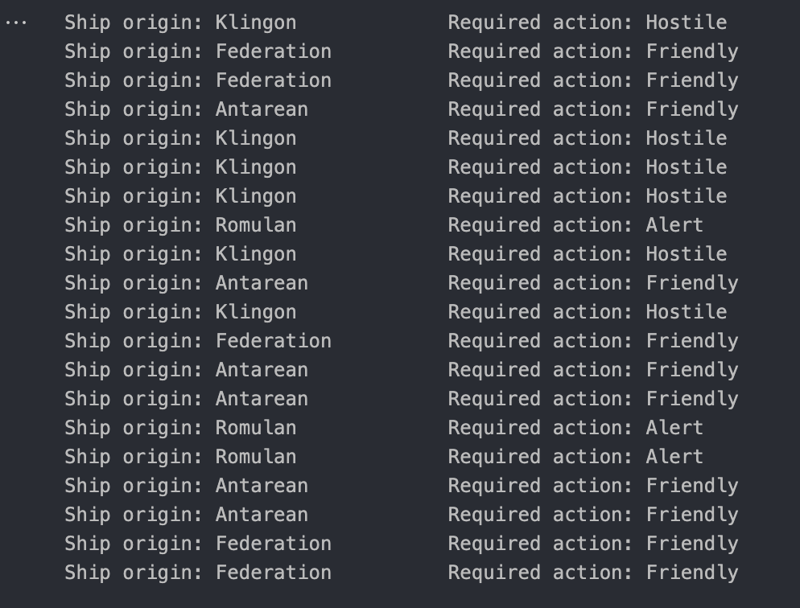

# HW5 Writeup

## Output Classifications

## Explanation of Methodologies

### Representation of Ship Features (f vectors)

- I used various different features in order to classify the ships. I tried to choose features that are distinguishable from each other between various species and ships.
  - Planet of Origin
  - Two or more consecutive consonants in the name
  - Ship starts with A or E
  - Ships warp drive >= 7.0
  - Colored ship?
  - Ships axis ratio 1.5 threshold
  - Ships transponder 1000 threshold
- The data was then placed into a separately coded CSV file that are coded for training

### Representation of Ship Origin (g vectors)

- The mean of all of the ships from each origin.

### Handling Missing Data

- Represented as 0 in the testing set.

### Learning Process

- Widrow Hoff Parameters:
  - Number of features: 7
  - Number of trials: 10,000
  - Learning constant: 0.1
- Randomly selected a F vector from the training set and then for each trial (10,000 iterations), we determine the g vector based on the planet origin, and updating the A matrix using the Widrow-Hoff function.
- Selected an f vector from the noisy data, predicted a g vector, and identified the closest mean vector from each planet as the ship's origin.

## Included in Write-up

Both f and g vectors are 7 x 20 matrices.

### Features

| f   | Name of Feature                             | Definition of Feature | Coding Scheme | How You Dealt With Missing Data |
| --- | ------------------------------------------- | --------------------- | ------------- | ------------------------------- |
| 1   | Planet of Origin                            | 1, 2, 3, 4            | Custom        | unknown=0                       |
| 2   | Warp drive >= 7.0                           | y=1, no=-1            | Binary        | --                              |
| 3   | Is the ship’s hailing transponder >= 1000.0 | y=1, no=-1            | Binary        | --                              |
| 4   | Does the ship name start with an A or an E  | y=1, no=-1            | Binary        | --                              |
| 5   | Is the ship’s axis ratio >= 1.5             | y=1, no=-1            | Binary        | --                              |
| 6   | Is the ship color bw, gray, color           | y=1, no=-1            | Binary        | --                              |
| 7   | Two consecutive consonants on the ship      | y=1, no=-1            | Binary        | --                              |
